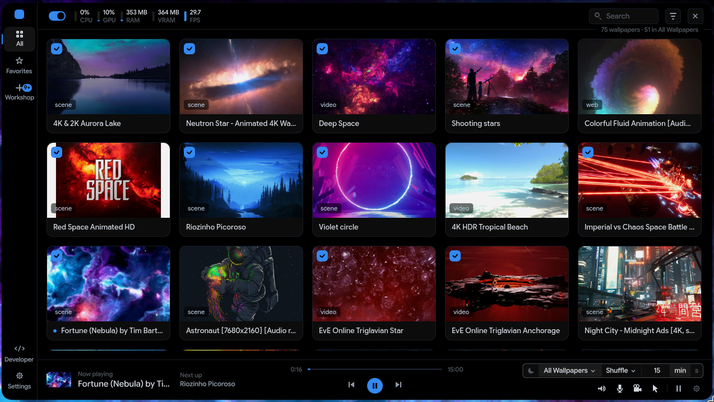
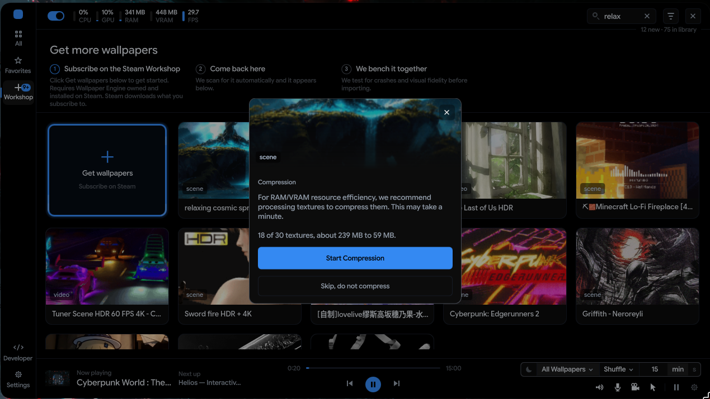
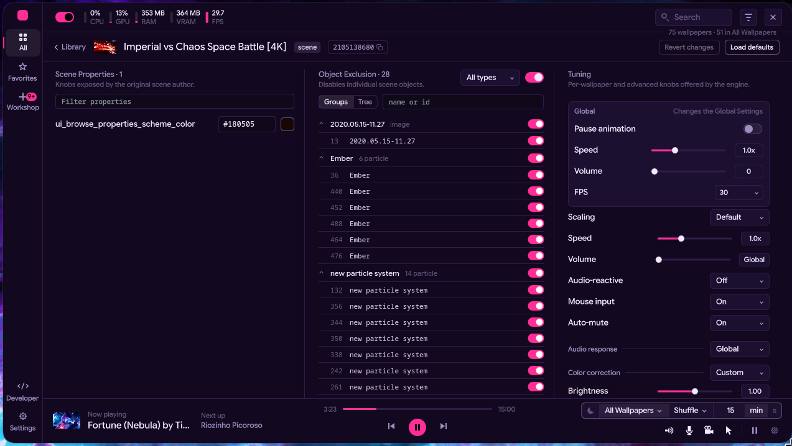
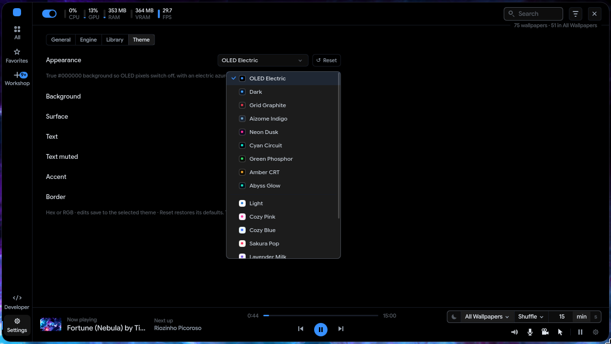
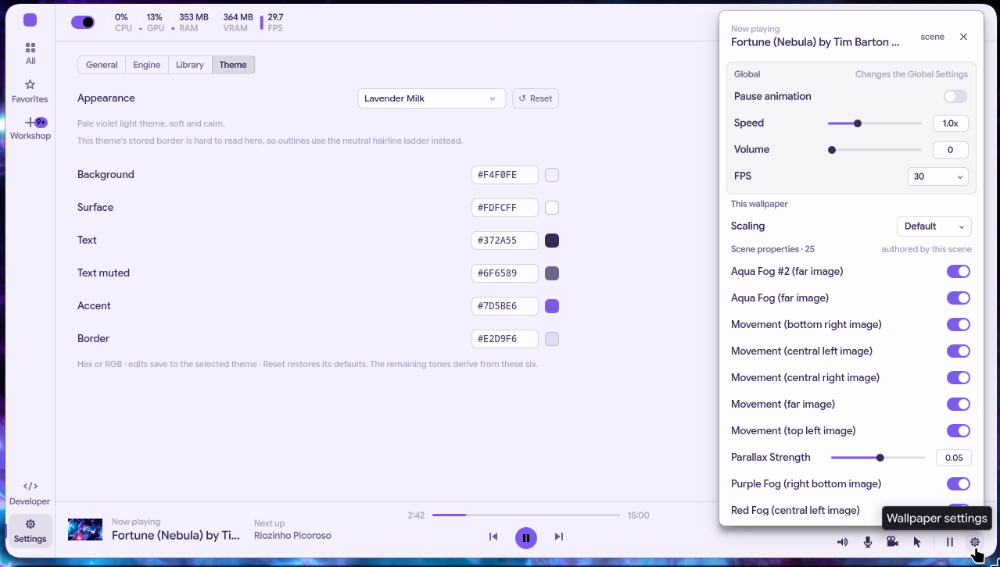

# linux-wallpaperengine (extended fork)

A heavily extended fork of [Almamu/linux-wallpaperengine](https://github.com/Almamu/linux-wallpaperengine),
the open-source engine that runs Wallpaper Engine backgrounds on Linux. This project
has used AI to assist in various aspects including parity work, engine architecture
changes, UI development, and documentation. This is also my first attempt on such a
complex project. There are going to be bugs needing to be fixed and methods needing
to be changed along the way.

The point of publishing is not to compete with upstream, but to act as a proof of
concept for the community, and to give back to it. Upstream built the foundation that
makes a project like this possible at all, and anything here that upstream wants is
theirs for the taking. None of this would exist without Almamu's engine, and my work
on this project building on upstream's code has given me a great appreciation for the
incredible effort that it must have taken to build this from scratch.

This fork's goal is a few things: make scene wallpapers render the way they do on
Windows with full parity, make the engine cheap enough on system resources to leave
running all day, and to provide the community with code and concept ideas that it can
take, modify, and use in open-source projects. The parity work here was built and
verified against the real Windows renderer, wallpaper by wallpaper, over several
months of side-by-side comparison. It's still nowhere near 100% complete, but most
scenes run remarkably close.

This was built and tested on a system with a 5000 series NVIDIA GPU and a 9000 series
AMD CPU running CachyOS with Hyprland. Brief verification was done on a VM running
CachyOS with KDE Plasma. The engine was briefly checked for portability using the AMD
iGPU successfully.

## What it looks like

The library, with the engine live on the desktop behind it. The status strip is
real: 75 wallpapers indexed, a 4K scene playing at the capped 30 FPS, 364 MB of
VRAM.



Texture compression at import. The wizard measures the scene and offers the
real numbers before it touches anything - here, 239 MB of raw textures down to
59 MB of BC7.



Per-scene editing: the knobs the scene author exposed, per-object exclusion for
every object in the scene, and the engine's own tuning rail.



Fourteen themes, defaulting to true-black OLED.



The Quick Panel floats over whatever you are doing - global controls and the
running scene's own properties, one click away from anywhere in the window. Light themes
are real, not an afterthought.



The repository is a pair that ships together:

- the engine (this directory) - the wallpaper renderer and its daemon
- [`lwe-ui/`](lwe-ui/) - the control panel, a PySide6/QML app split into a small
  tray process and a full window that starts on demand, driving the engine
  through its command API

[`ARCHITECTURE.md`](ARCHITECTURE.md) explains the machine: how the pieces fit, why
the design went this way, and where to start reading.
[`docs/FORK-MAP.md`](docs/FORK-MAP.md) is the per-capability reference behind it,
with `file::token` anchors for every claim, a complete switch and verb map, and a
guide to which pieces can be lifted on their own.

## What is different from upstream

### Rendering
- Camera and projection work: orthographic and perspective cameras, parallax, zoom,
  and script-driven view changes now behave much closer to the Windows renderer.
- Particles: playback-rate dilation, start times, event-driven children
  (spawn/death/follow), animated-texture cycle behavior,
  instance overrides, and count-override semantics.
- Puppet skeletal animation for rigged scene objects.
- Scene lighting: light objects, a from-scratch reimplementation of the generated
  lighting shader module, corrected light-direction conventions, and mesh
  winding/chirality fixes. 3D model objects render.
- An HDR bloom ladder (RGBA16F), used when a scene's bloom calls for it.
- Script engine: the module subsystem works, scripts tick values renderers actually
  read, object angles use the documented units, and an audio-response API is
  available to scripts.
- Per-object sound volume applies as playback gain.
- Text objects: placement, point sizing, and width-limit truncation.

Parity is judged wallpaper by wallpaper against the Windows client; plenty of scenes
now look right, and the ones that do not are how the work continues.

### Performance and VRAM
- Roughly half the VRAM of upstream on typical scenes, and on some scenes
  considerably more than half saved. The pieces: ingest-time BC7/BC4/BC5 texture
  compression (visually gated before it was made the default), FBO pooling for layer
  composites, a mip-residency texture pipeline so VRAM tracks what is actually on
  screen, and per-scene fixes found by measuring against the Windows client's
  footprint.

### Architecture
- Two-service design: the wallpaper engine proper and a separate web-content
  service. Chromium (CEF) is spawned only when a web wallpaper is actually in use
  and torn down to zero when it is not.
- A daemon mode with a Unix-socket command API: switch wallpapers, query status,
  pause, drive rotation, and change settings live without restarting anything.
- The daemon owns its own state: current wallpaper, rotation set, and playback
  settings persist to disk and restore on boot, so a service restart is
  invisible and no client has to babysit the engine. A crash-loop guard boots
  it idle instead of restoring into a repeating failure.
- Live property reload, a fullscreen-app policy handled by the engine itself
  (keep playing, pause, or free the outputs until the fullscreen window closes;
  stop frees the outputs only on the Wayland desktop and pauses elsewhere), and a
  running-apps rule: while a listed process is up, for example a local LLM that
  needs the VRAM, the engine pauses or, on the Wayland desktop, stands down on its
  own and comes back when the process exits. A stood-down engine is
  honest about it: VRAM is freed and resident memory drops to roughly 60 MB
  until the outputs come back.
- Console output from a misbehaving wallpaper is rate-limited so it cannot
  drown the engine's own logs.
- Hardened parsers for the binary formats a wallpaper package can carry, and hard
  caps on what a client of the command socket can do.

## The control panel (lwe-ui)

The engine's daemon API is the center of the architecture, and `lwe-ui/` is its
main client: a control panel that runs as a small tray process plus a full
window opened on demand, so closing the panel returns its memory while the
quick actions stay a right-click away. Library browsing,
rotation playlists, per-wallpaper settings (scaling, color correction,
animation speed, scene properties), a global frame-rate cap, Workshop import with a bench-test wizard,
theming, and a developer view exposing the engine's debug instruments.

The panel is installed by `install.sh` along with the engine. See
[`lwe-ui/README.md`](lwe-ui/README.md) for details.

## Installing

```
git clone https://github.com/portghost-dev/linux-wallpaperengine
cd linux-wallpaperengine
bash install.sh
```

`install.sh` installs the dependencies through pacman, builds the engine, and
puts the panel in its own virtualenv. It prints what it is doing at each step and
lets pacman ask before installing anything.

Scope, stated plainly: the project is x86-64 only, and it has been tested on
CachyOS under Hyprland and KDE Plasma. Other Arch-family systems should work.
Other distributions have not been tried; the build itself is ordinary cmake, so
adapt the dependency list from upstream's README and use the manual steps below.

## Uninstalling

If you enabled the engine service from the panel, stop it first:

```
systemctl --user disable --now lwe-engine.service
rm -f ~/.config/systemd/user/lwe-engine.service
```

Everything else lives under your home directory:

```
rm -f ~/.local/bin/linux-wallpaperengine ~/.local/bin/lwe ~/.local/bin/lwe-web-service
rm -f ~/.local/bin/lwe_bc7enc ~/.local/bin/lwe-ui
rm -rf ~/.local/lib/lwe-engine ~/.local/share/lwe-ui
rm -f ~/.local/share/applications/lwe-ui.desktop
rm -rf ~/.config/lwe ~/.local/state/lwe ~/.local/share/lwe
rm -f ~/.config/autostart/lwe-ui.desktop
```

The last line removes your settings, playlists, and the texture cache; keep it
if you plan to reinstall. The packages pacman installed are ordinary system
packages and stay; remove them with pacman if nothing else uses them.

## Building the engine by hand

```
cmake -S . -B build -DCMAKE_BUILD_TYPE=Release
make -C build -j$(nproc)
```

Arch's system Python refuses direct installs, so the panel wants a virtualenv.
Reusing the system Qt bindings keeps it from downloading a second copy of Qt:

```
python -m venv --system-site-packages ~/.local/share/lwe-ui/venv
~/.local/share/lwe-ui/venv/bin/python -m pip install ./lwe-ui
```

The configure step downloads the matching CEF binary distribution (large, one
time). Asset discovery is unchanged from upstream, and so is the dependency list
apart from ispc, which builds the BC7 texture-compression tool; see their
README if you are setting up from nothing.

Three notes for source builds:

- CEF's binary distribution ships a stripped `libvulkan.so.1` that can hijack the
  link when mpv pulls in a Vulkan-enabled libplacebo, surfacing as an undefined
  `vkCreateXlibSurfaceKHR`. The configure step deletes that copy, so a normal
  build resolves Vulkan against the system loader and needs no intervention.
- CEF ships only Release binaries. For a RelWithDebInfo build, symlink
  `RelWithDebInfo -> Release` inside the extracted CEF directory.
- The engine links ffmpeg by soname. When your distribution moves ffmpeg to a
  new major (8 to 9 changes `libavcodec.so.62` to `.63`, and so on) the built
  binary no longer starts, and a daemon that is already running hides that
  until it is restarted. Rebuild after such an update, and re-run the configure
  step first: CMake caches the full path of some libraries at configure time,
  SDL2 among them, so a bare `make` can fail to link against a file that no
  longer exists.

  ```
  cmake -B build
  make -C build -j$(nproc)
  ```

## Driving the engine from a shell

The panel is optional. The daemon speaks one JSON object per line over
`$XDG_RUNTIME_DIR/lwe/engine.sock`, and anything that can write to a Unix socket
can drive it:

```
{ printf '{"id":1,"cmd":"status"}\n'; sleep 1; } | socat - "UNIX-CONNECT:$XDG_RUNTIME_DIR/lwe/engine.sock"
{ printf '{"id":2,"cmd":"show","args":{"id":"1311951951"}}\n'; sleep 5; } | socat - "UNIX-CONNECT:$XDG_RUNTIME_DIR/lwe/engine.sock"
{ printf '{"id":3,"cmd":"next"}\n'; sleep 1; } | socat - "UNIX-CONNECT:$XDG_RUNTIME_DIR/lwe/engine.sock"
```

Replies come back as JSON lines with the same `id`; long commands answer
`accepted` first and `done` when the swap finishes. Hold the connection open
until the reply arrives: the engine drops a client as soon as it closes its
write half, so a bare `printf | socat` runs the command but reads nothing back. Every state-changing command,
and every scheduled rotation advance, is persisted by the engine itself, so a
rotation set up from the shell survives crashes and restarts with no client
running, and comes back on the wallpaper that was actually up. The full verb list with every
argument and bound is in [`docs/FORK-MAP.md`](docs/FORK-MAP.md) chapters 1 and
8; the wire schema is documented in `src/WallpaperEngine/Api/CommandDispatcher.h`.

`linux-wallpaperengine --version` prints the engine's version stamp alone on one line and exits, and the
`status` reply carries the same stamp in its `version` field.

The engine also answers to the name `lwe`, which `install.sh` links into `~/.local/bin`:
`lwe status`, `lwe off`, `lwe on` and `lwe --version` work with the engine alone. Every
other `lwe` command needs the panel.

## Settings

`linux-wallpaperengine --help` lists every flag with its values and default.
The engine takes thirteen settings. Give each one as a launch flag, or as the
environment variable beside it; when both are set, the flag wins. A flag's value
is checked when the engine starts, and a bad value stops it with a message that
names the flag. The `status` reply's `config` block shows each setting's value
and whether it came from a flag, the environment or the default.

| Flag | Variable | Takes | Default | What it does |
|---|---|---|---|---|
| `--resclamp` | `LWE_SSFACTOR` | a number up to 4; 0 or below is no cap | 1 | Caps the size a scene is drawn at, as a multiple of your largest screen. Lower saves video memory. It never enlarges anything, and turning it off can remove blur this cap caused. |
| `--effectclamp` | `LWE_CLAMPCOMPOSITES` | a number up to 4; 0 or below is no cap | 1 | The same cap for glow, blur and the other effect layers, set on its own. |
| `--texturecache` | `LWE_TEXCOMP` | on or off | on | Uses the compressed textures the panel builds; off loads the originals and deletes nothing. |
| `--texturedetail` | `LWE_TEXDETAIL` | auto or full | auto | auto loads smaller textures when your screen does not need the full size; full always loads everything. |
| `--videodecode` | `LWE_HWDEC` | software or auto | software | How video wallpapers are decoded; auto uses the graphics card when it can. |
| `--color` | `LWE_CC` | "brightness contrast saturation hue" | "1 1 1 0" | The color correction every wallpaper starts with. The flag takes the hue in degrees; the variable takes radians. |
| `--speed` | `LWE_TIMESCALE` | a number from 0 to 10 | 1 | How fast scene animation runs; 0 freezes it. |
| `--watchdog` | `LWE_DEADMAN` | whole seconds, or a whole number with s, m or h, up to 24h; 0 is off | 300 | Once the panel or another client has pinged the engine, if the engine then draws nothing and hears nothing for this long, it frees your screens (on the Wayland desktop; elsewhere it only logs). It restarts nothing. |
| `--lightdimming` | `LWE_CLASSICK` | 0.01 to 1000 | 16 | Overall brightness of the lights inside scenes; higher is dimmer. |
| `--lightfalloff` | `LWE_CLASSICEXP` | 0.5 to 6 | 2 | How quickly scene lights fade with distance. |
| `--audiogain` | `LWE_AUDIOGAIN` | 0.1 to 20 | 1 | How strongly wallpapers react to sound. |
| `--audiosmoothing` | `LWE_AUDIOSMOOTH` | 0 to 500 milliseconds, as 90 or 90ms | 90 | How smoothly the sound levels wallpapers react to change. |
| `--socket` | `LWE_SOCKET` | a path | `$XDG_RUNTIME_DIR/lwe/engine.sock`, else `/tmp/lwe-<uid>/engine.sock` | Where the engine listens for commands. |

Apart from `--watchdog`, number flags take plain decimal numbers: a sign, a
decimal point and an exponent such as 1e3 are fine, but not hex, inf or nan, and
-0 means 0.

Good to know:
- The panel's service passes its own settings to the engine, so when the panel
  runs the engine, change these in the panel. The flags are for an engine you
  start yourself: from a shell, a compositor config or your own unit.
- The variables keep their old forms: `LWE_CC` takes the hue in radians,
  `LWE_DEADMAN` plain seconds, `LWE_TIMESCALE` any speed up to 20, and
  `LWE_HWDEC` any of mpv's hardware decoding modes.
- With `--daemon`, a saved state brings back light dimming, light falloff and
  sound strength right after launch and shows the wallpaper that was on screen,
  with its own speed and color or else these flags' values. A wallpaper on the
  command line (`--wallpaper`, alone or after `--screen` or `--span`, or
  `--steamplaylist` after `--screen`) skips the saved state. The `config` block
  shows the flags' values. Two engines started with different `--socket` paths
  still share one saved state; give each its own `XDG_STATE_HOME`.
- A `show` command that carries its own caps or texture choices keeps them for
  that wallpaper, whatever the flags say.
- A value that starts with a dash can't be given unless it is a plain number
  such as -1; write a path that starts with a dash as `./-name`.

```
linux-wallpaperengine --screen DP-1 --wallpaper 2317494988 --resclamp 0 --texturedetail full --speed 0.5 --color "1.1 1 1.2 15" --watchdog 10m
```

### Plainer flag names

Every flag keeps its old spelling. Fifteen also have a plainer name. Both
spellings are the same flag, so giving both for a flag that can appear only once
is refused.

| Plainer name | Old name |
|---|---|
| `--screen` | `-r`, `--screen-root` |
| `--span` | `--screen-span` |
| `--wallpaper` | `-b`, `--bg` |
| `--steamplaylist` | `--playlist` |
| `--edge` | `--clamp` |
| `--mute` | `-s`, `--silent` |
| `--no-automute` | `--noautomute` |
| `--no-audioreactive` | `--no-audio-processing` |
| `--listen` | `--api-socket` |
| `--assetsfolder` | `--assets-dir` |
| `--no-particles` | `--disable-particles` |
| `--no-mouse` | `--disable-mouse` |
| `--no-parallax` | `--disable-parallax` |
| `--fullscreen-active-only` | `--fullscreen-pause-only-active` |
| `--fullscreen-ignore` | `--fullscreen-pause-ignore-appid` |

`--edge` takes extend, blank or tile, the same as the old words clamp, border
and repeat, which still work. The default is extend. It applies to the screen
named just before it; given before any screen, it sets the window and the
starting value for the screens named after it.

`--fullscreen keep`, `pause` or `stop` sets what happens while a game or app is
fullscreen: keep playing, pause, or stop and free the screens (stop frees the
screens only on the Wayland desktop and pauses elsewhere). Without it the engine
pauses, or stops with `--daemon`; `--fullscreen` wins over `--daemon` in either
order. `--no-fullscreen-pause` does the same as `keep`, unless a later
`--daemon` sets stop. `--fullscreen` and `--no-fullscreen-pause` can't be given
together. With `--daemon`, a restored state also brings back its saved
fullscreen choice.

### Debugging switches

The engine also has about eighty debugging switches for diagnosing problems.
They are unsupported and can change or disappear in any release.
`linux-wallpaperengine --help-debug` lists them, and `--debug switch=value` sets
one, for example `--debug audit=on`. Each name is an alias for an engine
variable, which still works.

## Troubleshooting

- On a machine with no usable GPU, CEF falls back to software rendering through
  `vulkan-swrast`. Web wallpapers still run, but slowly. This is a fallback, not
  a supported configuration.
- On KDE Plasma, the Peek at Desktop shortcut (Meta+D by default) hides the
  wallpaper along with the windows, because the wallpaper is a desktop-layer
  surface. Press it again to bring it back.

## About this repository

This repository began as a snapshot publication, a single commit on top of the
upstream base it was forked from. Development has continued here since.

Two of the calibration instruments used to bring the renderer to parity ship
in `tools/instruments/`: a generated HDR-bloom test scene and a generated
lighting probe, each with its generator, its readout script, a capture, and a
README explaining how to use it.

## Credits

- [Almamu](https://github.com/Almamu) and the linux-wallpaperengine contributors.
  This fork stands entirely on their engine, and it is meant as a thank-you to
  that work, not a replacement for it.
- Fixes and ideas were adopted from the parallel forks by
  [ian-vinson](https://github.com/ian-vinson) and
  [Haberno](https://github.com/Haberno), including CEF bootstrap fixes, live
  property reload, audio device handling, config parsing, package lookup behavior,
  and parts of the shadow and tube-light work that extended this fork's existing
  lighting system. Their work is credited here rather than inline in the source.
- Texture compression uses Intel's
  [ISPC Texture Compressor](https://github.com/GameTechDev/ISPCTextureCompressor),
  vendored under `src/External/ISPCTextureCompressor/` and used under the MIT
  license included there.
- Wallpaper Engine itself is the work of
  [Kristjan Skutta](https://store.steampowered.com/app/431960/Wallpaper_Engine/).
  This project renders content you own through your own Steam license; it ships
  none of Wallpaper Engine's assets.

## License

GPLv3, same as upstream. See LICENSE. The `lwe-ui/` control panel is separately
MIT-licensed; see `lwe-ui/pyproject.toml`.
