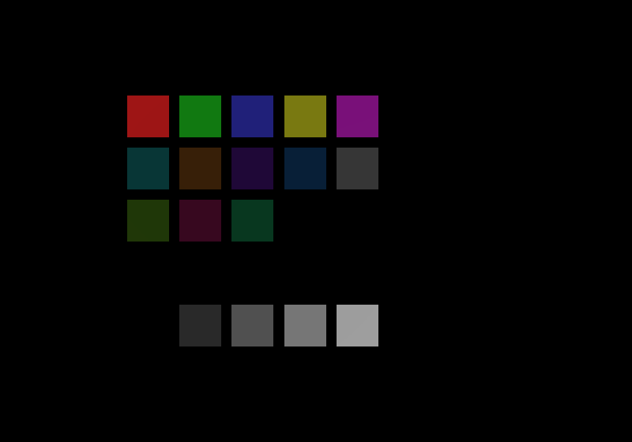

# Facet dial

A generated lighting probe: a 5x5 grid of flat billboard plates in which every
plate lies about its orientation. The geometry faces the camera so all plates
stay visible, but each plate carries an authored per-vertex normal pointing a
different direction: rings at 40, 70, 90 (edge-on), 120 and 150 degrees from
the camera axis, one straight-on plate, one facing directly away, and a
four-step gray albedo ladder on identical straight-on normals.

One capture therefore samples the lighting model at 21 known angles at once.
Mean RGB over each plate's fixed screen rect, fed through a known-normal
linear solve, recovers the direction the engine believes the light points and
whether its falloff matches Lambert; the away-facing plates read the ambient
and skylight floor instead of assuming it, and the gray ladder reads back the
output transfer curve (gamma and tonemap) in every capture.

Each plate is painted a unique flat color from a generated palette so a
readout script can identify every plate in a capture by nearest-match hue, with
no dependence on screen position.



Capture cropped to the grid. Dark cells are the edge-on and away-facing
plates: at those angles a directional light contributes nothing, which is
itself one of the checks.

## Usage

```
gen_dial.py OUTDIR    # creates OUTDIR/ as a runnable wallpaper directory
```

The script writes everything itself: the `.mdl` model (positions, authored
normals, tangents, indices, packed to the MDLV0023 layout), the 32x1 palette
`.tex`, a matte `generic4` material, `scene.json` with a single calibration
directional light, and a `DIAL-MANIFEST.json` mapping every plate name to its
normal, palette color, grid slot and albedo. No editor and no third-party
assets are involved; regeneration is deterministic, so a fix can be A/B'd
against a bit-identical scene.

Authoring normals that disagree with the geometry is the whole point, and it
is also why this cannot be built in the Wallpaper Engine editor.

## Readout

```
dial_read.py <cap.ppm> <DIAL-MANIFEST.json> <engine.log> [--solve]
```

`dial_read.py` reads a PPM capture back into a per-plate RGB table. It maps
scene coordinates to capture pixels using the engine's own present telemetry:
run the engine with `LWE_PRESENTTRACE=1` and pass its log, and the final
`LWE-PRESENT` line gives the exact viewport mapping, so there is no fitting or
searching. Every plate must be hue-verified against its manifest color before
it is trusted; a plate whose rect does not match its key is flagged
UNIDENTIFIED rather than guessed. With `--solve` it runs the known-normal
least-squares fit and prints the recovered light direction, gain, ambient
floor, and the fit residual.
