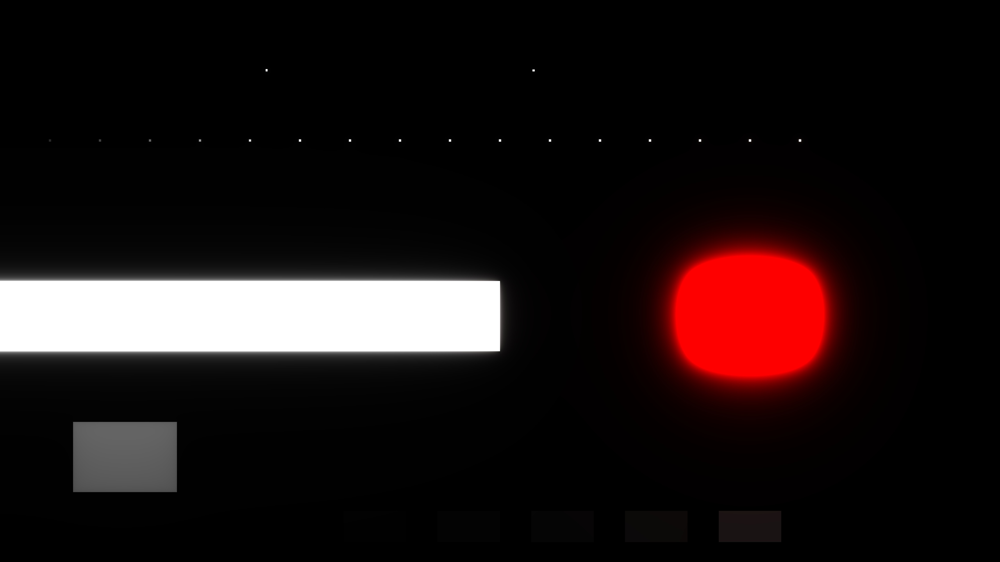

# HDR bloom gauntlet

A generated calibration scene for the HDR bloom pipeline. Instead of judging
bloom against a busy wallpaper, it puts five known fixtures on a black
1920x1080 canvas so each behavior can be read in isolation:

1. **Impulse strip.** Sixteen 4x4-pixel emitters stepping in intensity from
   0.4 to 1.9. A near-point emitter's halo is the bloom's spread function made
   visible; the ladder shows where glow engages and how it grows.
2. **Phase pair.** Two identical emitters, one texel-aligned, one offset by
   half a texel. Halo-centroid drift between them means the blur samples
   off-center.
3. **Hard edge.** A 0-to-1 white half-rect band. The blurred edge's midpoint
   tells you whether the blur ran in linear light or in sRGB.
4. **Red plate.** Pure (1,0,0) at brightness 3. Clipping that shifts the hue
   shows up immediately.
5. **Gray plates.** A flat 0.5 gray plate for banding, and five patches below
   the bloom threshold that must produce zero glow.

Intensities above 1.0 are authored the way Wallpaper Engine does it: layer
color carries the part up to 1.0 and per-layer brightness carries the rest.
Every plate is built from the stock `models/util/solidlayer.json` in the
Wallpaper Engine assets; the scene contains no third-party content.



The capture above is the center-point scene: the impulse ladder across the
top, the phase pair above it, the glowing edge band, the red plate's halo,
the flat gray plate, and the below-threshold ramp staying dark along the
bottom.

## Usage

```
gen_gauntlet.py OUTDIR            # center-point scene only
gen_gauntlet.py OUTDIR --matrix   # + one-factor-at-a-time knob sweeps
```

Each variant is a loose wallpaper directory (`project.json` + `scene.json`)
that loads in this engine and in Wallpaper Engine. `--matrix` sweeps each of
the five HDR bloom knobs (iterations, scatter, feather, strength, threshold)
around a fixed center point, plus two designed interaction blocks, and writes
a `MANIFEST.json` naming every variant. Render the same variant under two
engines, difference the captures, and the knob whose sweep diverges is the
one whose math is wrong.

## Readout

```
gauntlet_read.py IMAGE [--flipped] [--encode] [--json OUT]
```

`gauntlet_read.py` turns a capture into the fixture numbers: per-emitter peak,
halo energy and radial profile for the impulse strip, centroid drift for the
phase pair, a scan across the hard edge (midpoint near 128 means the blur ran
in encoded space, near 188 means linear), red plate and halo means for the hue
check, and per-patch leak numbers for the threshold ramp. It is
engine-agnostic: any resolution works, coordinates scale from the 1920x1080
authoring space. Pass `--flipped` for captures whose y axis runs opposite the
authoring coordinates (Windows captures do), and `--encode` if the capture
holds linear values that need sRGB encoding before comparison. `--json`
writes the full result set for diffing two engines' numbers directly.
